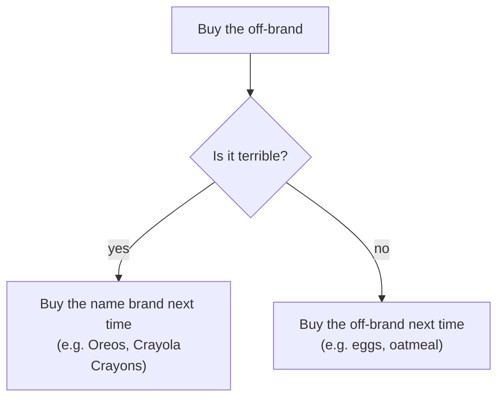

Despite the propaganda peddled by the IPA enthusiasts, whiskey connoisseurs, hipster folk, et al. Most alcohol is pretty gross. For me at least, it not consumed for the flavor. It's consumed because it's a cold beverage, to be social, or maybe even just for the carbonation. And surely I can't be the only one, how else can we explain the rise of the oxymoronic hard seltzers. But, there are exceptions: Amaretto Sours. Yum. In case you need a mixology refresher:

Amaretto Sour

> - 1.5 part Amaretto
> - 1 part Sweet Mix
> - 1 part seltzer (or sprite if you want it sweeter)
> - Ice

Friday night: Amaretto Sour time. We had a bottle of _Di Amore_ Amaretto in a glass bottle we’d used for other drinks and it was running low. We needed some foodstuffs anyway so we stopped by the liquor store on our way back from the grocery. The store had two brands of amaretto available: _Romeo_ for $6.99 and _Disarronno_ for $23.99. “We’re not snooty” I said and we grabbed the cheaper one.

I got home and we decided to do a qualitative taste test between the remainder of the _Di Amore_ and the _Romeo_ we just purchased. Call me naïve, but I wasn’t expecting too much of a difference, as we had previously done blind tasting with wines of different prices and were generally unsuccessful at picking out the pricer bottles. I poured myself some _Romeo_ into a small shot glass and took a whiff. It smelled nice, like almond extract. So I took my first sip of _Romeo_ and immediately spit it out into the sink.

Apparently we are snooty :( Instead of the sweet, almond-apricot taste I was expecting, it tasted like paint thinner smells. I tried each of the amarettos a few more times and for me it was undeniable, there was a substantial quality difference. It was even apparent in the mixed drinks.

General system for product purchases:

We dealt for that night, but I was intrigued and excited about what filled the gap between the $7 amaretto and the $30 amarettos. So the next day, I spend about \$100 buying one bottle of every brand of Amaretto I could find. Turns out, based on what I could find, there are really only two major tiers: expensive and cheap. We poured out some tasters into numbered shot glasses and set to work. Here are my impressions:

| Brand     | Price\* | Rank | Tasting Notes                                                                                                                                                                                                                                                                                                                                                                                                                |
| --------- | ------- | ---- | ---------------------------------------------------------------------------------------------------------------------------------------------------------------------------------------------------------------------------------------------------------------------------------------------------------------------------------------------------------------------------------------------------------------------------- |
| Romeo     | \$7.48  | 6th  | Yuck. Tastes like alcohol, in a bad way. It’s even bad when mixed with copious amount of sprite and orange juice. Pass.                                                                                                                                                                                                                                                                                                      |
| DiAmore   | \$15.98 | 2nd  | Twice as expensive but more than ten times as good. Nothing really fancy to set it apart taste-wise. I think this is a perfect choice for mixed drinks.                                                                                                                                                                                                                                                                      |
| Disaronno | \$15.98 | 3rd  | Also way better than Romeo (really that’s on a trash tier by itself). A little more distinctive tasting than the DiAmore though. I’ll say darker and smokier. If I were a wine connoisseur, I would say it’s more “woodsy”, whatever that means.                                                                                                                                                                             |
| Lazzaroni | \$23.98 | 5th  | I don't like this one, but not because it tastes like pure alcohol (thank goodness). I think it tastes, almost like a vegetable. Peppers? Maybe like basil? Supposedly it’s made with amoretti cookies, which I mostly enjoy, but every time I eat those cookies thinking there is something a little off-putting about them. They seem to have distilled whatever that off-putting thing is and made it into this amaretto. |  |
| Luxardo   | \$24.98 | 4th  | Kinda tastes like red licorice. It’s interesting, it might even be the second best one to drink neat or on the rocks because it has lots to decipher. Overall the red licorice doesn't quite do it for me. I’ll take the Gozio for the same price hands down.                                                                                                                                                                |
| Gozio     | \$24.98 | 1st  | My favorite, sweet and nutty. I think it also tastes a bit tangy, like green apples. Mmmmm. I’ll just have it neat please, thank you very much.                                                                                                                                                                                                                                                                              |

\* Prices were taken all from the same store which was not the liquor store we visited in the story above, hence the price difference
